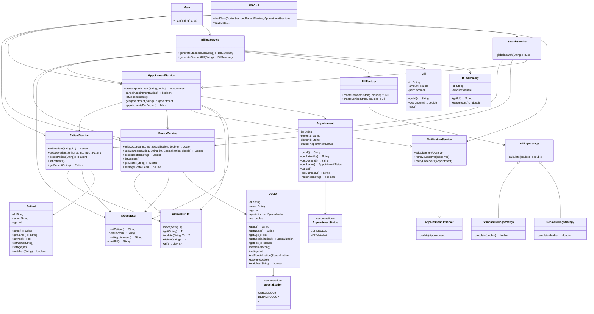

# Design Decisions

## Overview

MediTrack follows object-oriented principles with design patterns for maintainability and extensibility.

## Key Decisions

- **Layered Architecture**: Entities, Services, Utilities.
- **Dependency Injection**: Services injected into Main for loose coupling.
- **Observer Pattern**: For appointment notifications.
- **Factory Pattern**: For bill creation.
- **Strategy Pattern**: For billing strategies.
- **In-Memory Data Store**: With CSV persistence for simplicity.

## UML Class Diagram

